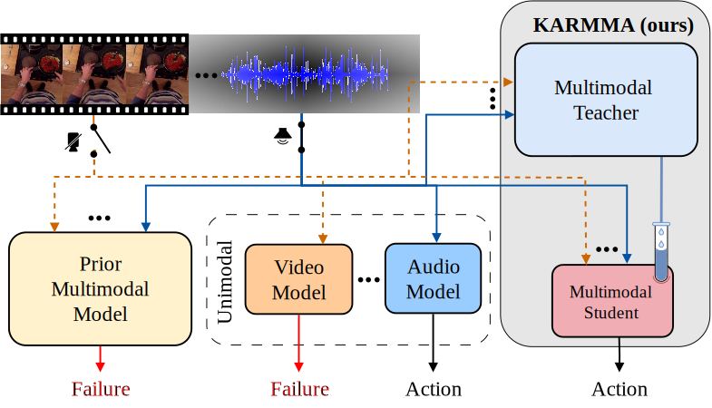

<h1>Multimodal Knowledge Distillation for Egocentric Action Recognition Robust to Missing Modalities</h1>

[**Maria Santos-Villafranca**](https://maria-sanvil.github.io/)* 1
[**Dustin Carrión-Ojeda**](https://dustincarrion.github.io/)* 2,3
[**Alejandro Perez-Yus**](https://i3a.unizar.es/es/investigadores/alejandro-perez-yus)1
[**Jesus Bermudez-Cameo**](https://jesusbermudezcameo.github.io/)1
[**Jose J. Guerrero**](https://webdiis.unizar.es/~jguerrer/)1
[**Simone Schaub-Meyer**](https://schaubsi.github.io/)2,3

1University of Zaragoza
2TU Darmstadt
3hessian.AI
*equal contribution

---

🚧 The code will be released soon. Stay tuned!

## 🚀 About
This repository contains the official implementation of the paper *Multimodal Knowledge Distillation for Egocentric Action Recognition Robust to Missing Modalities*.

  

Existing methods for egocentric action recognition often rely solely on RGB videos, although additional modalities, e.g., audio, can improve accuracy in challenging scenarios. However, most multimodal approaches assume all modalities are available at inference, leading to significant accuracy drops, or even failure, when inputs are missing. To address this, we introduce KARMMA, a multimodal <b>K</b>nowledge distillation framework for egocentric <b>A</b>ction <b>R</b>ecognition robust to <b>M</b>issing <b>M</b>od<b>A</b>lities that requires no modality alignment across all samples during training or inference. KARMMA distills knowledge from a multimodal teacher into a multimodal student that benefits from all available modalities while remaining robust to missing ones, making it suitable for diverse scenarios without retraining. Our student uses approximately 50% fewer computational resources than our teacher, resulting in a lightweight and fast model. Experiments on Epic-Kitchens and Something-Something show that our student achieves competitive accuracy while significantly reducing accuracy drops under missing modality conditions.

